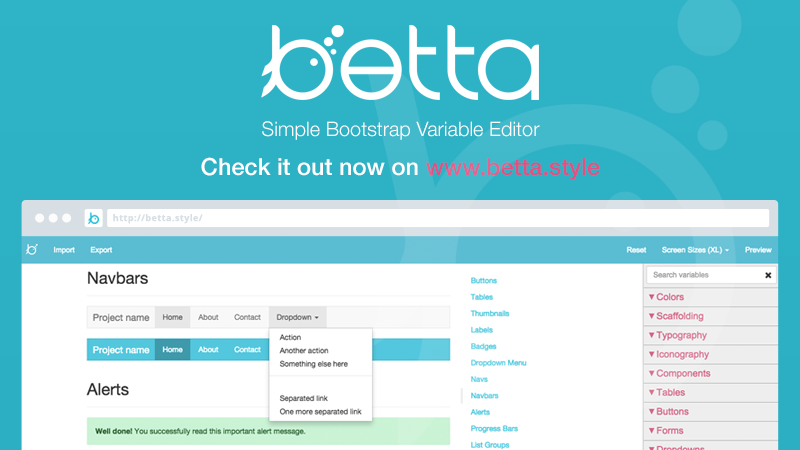

# Betta 

### Simple Bootstrap Variable Editor - [www.betta.style](http://betta.style)

### Development
You will need to install and run an http server. Example:

    npm install
    npm start

### Tests
    npm install
    npm test

### License
Copyright (c) 2015 Jake 'Sid' Smith, [DabApps](http://www.dabapps.com). For more information, see the LICENSE file in this repository.

## Code of conduct

For guidelines regarding the code of conduct when contributing to this repository please review [https://www.dabapps.com/open-source/code-of-conduct/](https://www.dabapps.com/open-source/code-of-conduct/)
